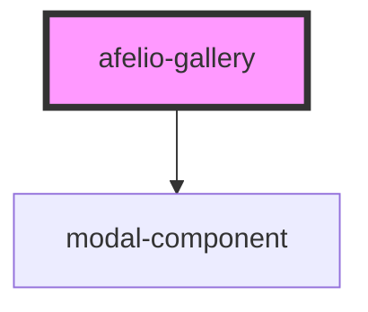

# afelio-gallery

<!-- Auto Generated Below -->

## Properties

| Property         | Attribute | Description | Type                   | Default                                                                                                                                                                                                                                                                                                        |
| ---------------- | --------- | ----------- | ---------------------- | -------------------------------------------------------------------------------------------------------------------------------------------------------------------------------------------------------------------------------------------------------------------------------------------------------------- |
| `galleryOptions` | --        |             | `AfelioGalleryOptions` | `undefined`                                                                                                                                                                                                                                                                                                    |
| `images`         | --        |             | `string[]`             | `[ 		'https://mir-s3-cdn-cf.behance.net/project_modules/1400_opt_1/db530b53956937.59480e2e544f5.png', 		'https://mir-s3-cdn-cf.behance.net/project_modules/1400_opt_1/06198253956937.59480e2e53bc9.png', 		'https://mir-s3-cdn-cf.behance.net/project_modules/1400_opt_1/7a0cc153956937.59480e2e549d5.jpg' 	]` |

## Dependencies

### Depends on

- [modal-component](../modal-component)

### Graph

----------------------------------------------

*Built with [StencilJS](https://stenciljs.com/)*
