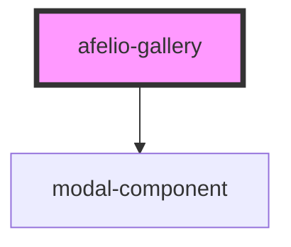

# afelio-gallery

<!-- Auto Generated Below -->

## Properties

| Property            | Attribute             | Description | Type       | Default                            |
| ------------------- | --------------------- | ----------- | ---------- | ---------------------------------- |
| `backropClickClose` | `backrop-click-close` |             | `boolean`  | `true`                             |
| `closeIconUrl`      | `close-icon-url`      |             | `string`   | `'assets/images/SVG/close.svg'`    |
| `enableRotate`      | `enable-rotate`       |             | `boolean`  | `true`                             |
| `images`            | --                    |             | `string[]` | `[]`                               |
| `nextIconUrl`       | `next-icon-url`       |             | `string`   | `'assets/images/SVG/next.svg'`     |
| `previousIconUrl`   | `previous-icon-url`   |             | `string`   | `'assets/images/SVG/previous.svg'` |
| `rotateIconUrl`     | `rotate-icon-url`     |             | `string`   | `'assets/images/SVG/rotate.svg'`   |

## Dependencies

### Depends on

- [modal-component](../modal-component)

### Graph

----------------------------------------------

*Built with [StencilJS](https://stenciljs.com/)*
