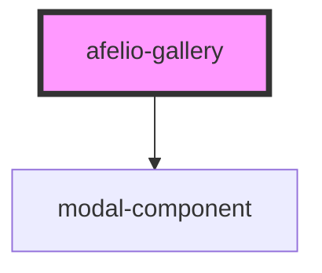

# afelio-gallery

<!-- Auto Generated Below -->

## Properties

| Property            | Attribute             | Description | Type       | Default                                                                                                                                                                                                                                                                                                                                                                                                                                                                                                                                                                                                                                                                                                                                                                                                                                                                                                                                                                                                                                                                                                                                     |
| ------------------- | --------------------- | ----------- | ---------- | ------------------------------------------------------------------------------------------------------------------------------------------------------------------------------------------------------------------------------------------------------------------------------------------------------------------------------------------------------------------------------------------------------------------------------------------------------------------------------------------------------------------------------------------------------------------------------------------------------------------------------------------------------------------------------------------------------------------------------------------------------------------------------------------------------------------------------------------------------------------------------------------------------------------------------------------------------------------------------------------------------------------------------------------------------------------------------------------------------------------------------------------- |
| `backropClickClose` | `backrop-click-close` |             | `boolean`  | `true`                                                                                                                                                                                                                                                                                                                                                                                                                                                                                                                                                                                                                                                                                                                                                                                                                                                                                                                                                                                                                                                                                                                                      |
| `closeIconUrl`      | `close-icon-url`      |             | `string`   | `'data:image/svg+xml;utf8,<svg viewBox="0 0 691 691" version="1.1" xmlns="http://www.w3.org/2000/svg" xmlns:xlink="http://www.w3.org/1999/xlink"><g id="Page-1" stroke="none" stroke-width="1" fill="none" fill-rule="evenodd"><circle id="Oval-Copy-2" stroke="%235D5D5D" fill-opacity="0.5" fill="%23FFFFFF" transform="translate(345.500000, 345.500000) rotate(-180.000000) translate(-345.500000, -345.500000) " cx="345.5" cy="345.5" r="344.5"></circle><path d="M160,159 L532.40625,531.40625" id="Path" stroke="%235D5D5D" stroke-width="41" stroke-linecap="round"></path><path d="M160,159 L532.40625,531.40625" id="Path" stroke="%235D5D5D" stroke-width="41" stroke-linecap="round" transform="translate(346.203125, 345.203125) rotate(-270.000000) translate(-346.203125, -345.203125) "></path></g></svg>'`                                                                                                                                                                                                                                                                                                                |
| `enableRotate`      | `enable-rotate`       |             | `boolean`  | `true`                                                                                                                                                                                                                                                                                                                                                                                                                                                                                                                                                                                                                                                                                                                                                                                                                                                                                                                                                                                                                                                                                                                                      |
| `images`            | --                    |             | `string[]` | `[]`                                                                                                                                                                                                                                                                                                                                                                                                                                                                                                                                                                                                                                                                                                                                                                                                                                                                                                                                                                                                                                                                                                                                        |
| `nextIconUrl`       | `next-icon-url`       |             | `string`   | `'data:image/svg+xml;utf8,<svg viewBox="0 0 600 600" version="1.1" xmlns="http://www.w3.org/2000/svg" xmlns:xlink="http://www.w3.org/1999/xlink"><g id="Page-1" stroke="none" stroke-width="1" fill="none" fill-rule="evenodd"><circle id="Oval"  fill-opacity="0.5" fill="%23FFFFFF" cx="300" cy="300" r="299"></circle><g id="next" transform="translate(228.000000, 99.000000)" stroke="%235D5D5D" stroke-linecap="round" stroke-linejoin="round" stroke-width="41"><polyline id="arrow-next" transform="translate(101.416016, 201.767578) rotate(-180.000000) translate(-101.416016, -201.767578) " points="198.781251 0.984375 0.015626 199.75 202.816407 402.550781"></polyline></g></g></svg>'`                                                                                                                                                                                                                                                                                                                                                                                                                                      |
| `previousIconUrl`   | `previous-icon-url`   |             | `string`   | `'data:image/svg+xml;utf8,<svg viewBox="0 0 600 600" version="1.1" xmlns="http://www.w3.org/2000/svg" xmlns:xlink="http://www.w3.org/1999/xlink"><g id="Page-1" stroke="none" stroke-width="1" fill="none" fill-rule="evenodd"><circle id="Oval" stroke="%235D5D5D" fill-opacity="0.5" fill="%23FFFFFF" transform="translate(300.000000, 300.000000) rotate(-180.000000) translate(-300.000000, -300.000000) " cx="300" cy="300" r="299"></circle><g id="next" transform="translate(270.500000, 299.500000) rotate(-180.000000) translate(-270.500000, -299.500000) translate(169.000000, 98.000000)" stroke="%235D5D5D" stroke-linecap="round" stroke-linejoin="round" stroke-width="41"><polyline id="arrow-next" transform="translate(101.416016, 201.767578) rotate(-180.000000) translate(-101.416016, -201.767578) " points="198.781251 0.984375 0.015626 199.75 202.816407 402.550781"></polyline></g></g></svg>'`                                                                                                                                                                                                                   |
| `rotateIconUrl`     | `rotate-icon-url`     |             | `string`   | `'data:image/svg+xml;utf8,<svg viewBox="0 0 839 839" version="1.1" xmlns="http://www.w3.org/2000/svg" xmlns:xlink="http://www.w3.org/1999/xlink"><g id="Page-1" stroke="none" stroke-width="1" fill="none" fill-rule="evenodd"><g id="rotate" transform="translate(419.500000, 419.500000) scale(-1, 1) translate(-419.500000, -419.500000) "><circle id="Oval-Copy" fill-opacity="0.5" fill="%23FFFFFF" transform="translate(419.500000, 419.500000) rotate(-180.000000) translate(-419.500000, -419.500000) " cx="419.5" cy="419.5" r="419.5"></circle><path d="M165.507668,216.714102 C226.591687,140.249711 319.232976,94.5 419.5,94.5 C598.992544,94.5 744.5,240.007456 744.5,419.5 C744.5,598.992544 598.992544,744.5 419.5,744.5 C408.178163,744.5 399,735.321837 399,724 C399,712.678163 408.178163,703.5 419.5,703.5 C576.348869,703.5 703.5,576.348869 703.5,419.5 C703.5,262.651131 576.348869,135.5 419.5,135.5 C337.235515,135.5 260.892773,170.706177 207.671441,230.312304 L278.452854,253.139956 L114.846529,419.975864 L79.5415975,188.989259 L165.507668,216.714102 Z" id="Oval" fill="%235D5D5D"></path></g></g></svg>'` |

## Dependencies

### Depends on

- [modal-component](../modal-component)

### Graph

----------------------------------------------

*Built with [StencilJS](https://stenciljs.com/)*
