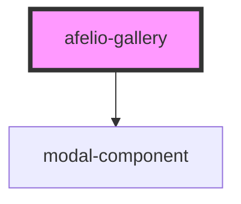

# afelio-gallery

<!-- Auto Generated Below -->

## Properties

| Property         | Attribute | Description | Type                   | Default     |
| ---------------- | --------- | ----------- | ---------------------- | ----------- |
| `galleryOptions` | --        |             | `AfelioGalleryOptions` | `undefined` |
| `images`         | --        |             | `string[]`             | `[]`        |

## Events

| Event               | Description | Type               |
| ------------------- | ----------- | ------------------ |
| `customActionFired` |             | `CustomEvent<any>` |
| `deleteImage`       |             | `CustomEvent<any>` |

## Dependencies

### Depends on

- [modal-component](../modal-component)

### Graph

----------------------------------------------

*Built with [StencilJS](https://stenciljs.com/)*
