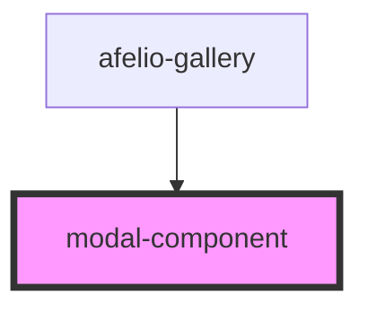

# modal-component

<!-- Auto Generated Below -->

## Properties

| Property            | Attribute             | Description | Type       | Default     |
| ------------------- | --------------------- | ----------- | ---------- | ----------- |
| `backropClickClose` | `backrop-click-close` |             | `boolean`  | `undefined` |
| `closeIconUrl`      | `close-icon-url`      |             | `string`   | `undefined` |
| `enableRotate`      | `enable-rotate`       |             | `boolean`  | `undefined` |
| `imagesLink`        | --                    |             | `string[]` | `undefined` |
| `indexImageShowed`  | `index-image-showed`  |             | `number`   | `undefined` |
| `nextIconUrl`       | `next-icon-url`       |             | `string`   | `undefined` |
| `previousIconUrl`   | `previous-icon-url`   |             | `string`   | `undefined` |
| `rotateIconUrl`     | `rotate-icon-url`     |             | `string`   | `undefined` |

## Dependencies

### Used by

 - [afelio-gallery](../afelio-gallery)

### Graph

----------------------------------------------

*Built with [StencilJS](https://stenciljs.com/)*
