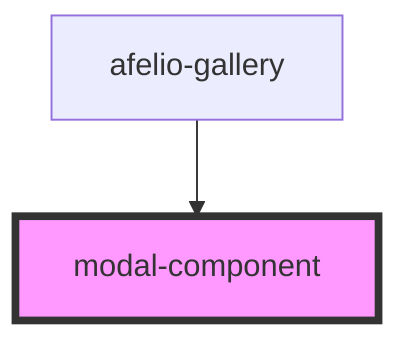

# modal-component

<!-- Auto Generated Below -->

## Properties

| Property           | Attribute            | Description | Type                   | Default     |
| ------------------ | -------------------- | ----------- | ---------------------- | ----------- |
| `galleryOptions`   | --                   |             | `AfelioGalleryOptions` | `undefined` |
| `imagesLink`       | --                   |             | `string[]`             | `undefined` |
| `indexImageShowed` | `index-image-showed` |             | `number`               | `undefined` |

## Events

| Event         | Description | Type               |
| ------------- | ----------- | ------------------ |
| `deleteImage` |             | `CustomEvent<any>` |

## Dependencies

### Used by

 - [afelio-gallery](../afelio-gallery)

### Graph

----------------------------------------------

*Built with [StencilJS](https://stenciljs.com/)*
