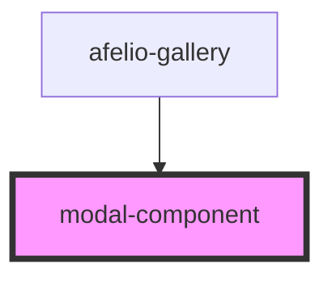

# modal-component

<!-- Auto Generated Below -->

## Properties

| Property           | Attribute            | Description | Type       | Default     |
| ------------------ | -------------------- | ----------- | ---------- | ----------- |
| `imagesLink`       | --                   |             | `string[]` | `undefined` |
| `indexImageShowed` | `index-image-showed` |             | `number`   | `undefined` |

## Dependencies

### Used by

 - [afelio-gallery](..\afelio-gallery)

### Graph

----------------------------------------------

*Built with [StencilJS](https://stenciljs.com/)*
